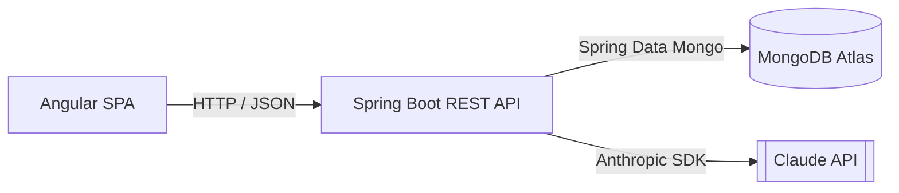

# UML Class Diagrams — Star Awards

*Simplified for presentation — class names, key attributes and relationships only. Built from the real source in `backend/src/main/java/com/example/tagging` and `frontend/src/app`.*

Five diagrams, each a different slice of the system. GitHub, GitLab and VS Code all render the ` ```mermaid ` blocks below automatically; if your viewer doesn't, paste the block into the [Mermaid Live Editor](https://mermaid.live).

| File | Covers |
| --- | --- |
| [`domain-model.md`](domain-model.md) | What's persisted in MongoDB — `Nomination`, `UserAccount`, `ReviewStateDocument` and their enums |
| [`api-contracts.md`](api-contracts.md) | The request/response shapes that cross HTTP, including `NominationView` |
| [`service-architecture.md`](service-architecture.md) | How the backend is wired — controllers → services → repositories |
| [`strategy-pattern.md`](strategy-pattern.md) | The strategy pattern behind nomination tagging |
| [`frontend.md`](frontend.md) | The Angular models and services that mirror the backend |

## System context

The Angular SPA never talks to MongoDB directly — every read and write goes through the Spring Boot REST API, which persists to MongoDB Atlas and calls the Claude API for an AI verdict on each nomination.



## How to read these diagrams

| Notation | Meaning |
| --- | --- |
| `<<interface>>` | A Java interface or a TypeScript interface — a contract, no state of its own |
| `<<record>>` | An immutable Java record — a plain data carrier |
| `<<enumeration>>` | A fixed, closed set of constants |
| `<<controller>>` / `<<service>>` / `<<repository>>` | The class's role in the backend |
| `A --|> B` | **Inheritance** — A is a kind of B |
| `A ..|> B` | **Realization** — A implements interface B |
| `A --> B` | **Association** — A holds or uses B |
