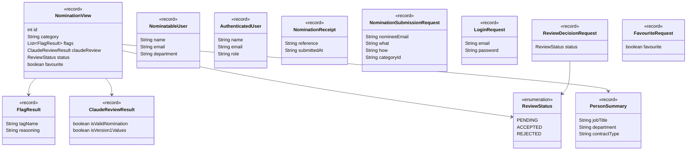

# API Contract Layer

*Part of the [Star Awards class diagrams](README.md).*

The request and response shapes that cross HTTP between the Angular app and the Spring Boot API. `NominationView` is the important one — it's a full row on the reviewer dashboard.

