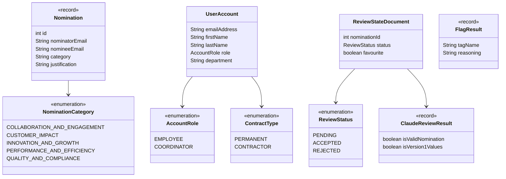

# Persisted Domain Model

*Part of the [Star Awards class diagrams](README.md).*

The three things stored in MongoDB — a nomination, a user account, and the reviewer's decision on that nomination — plus the small value types and enums they're built from.

`Nomination` and `ReviewStateDocument` are separate documents in separate collections, joined by nomination id — the nomination itself never changes once submitted, only the reviewer's decision does.
