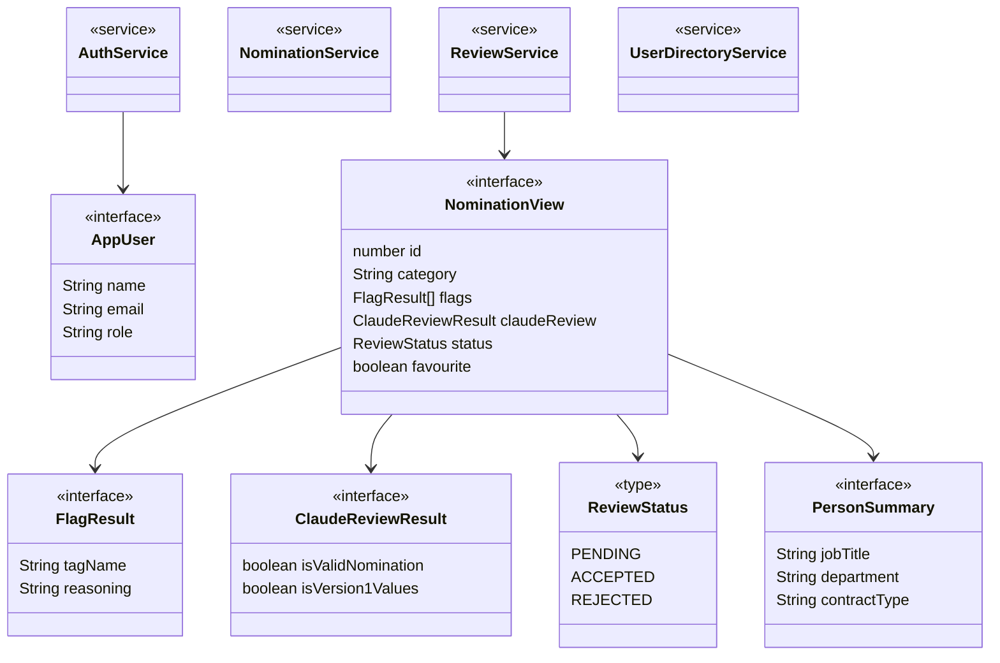

# Angular Frontend — Models & Services

*Part of the [Star Awards class diagrams](README.md).*

The data shapes are TypeScript interfaces, kept in step with the Java records on the backend. The four services are the app's only stateful classes — each wraps one slice of the API.

