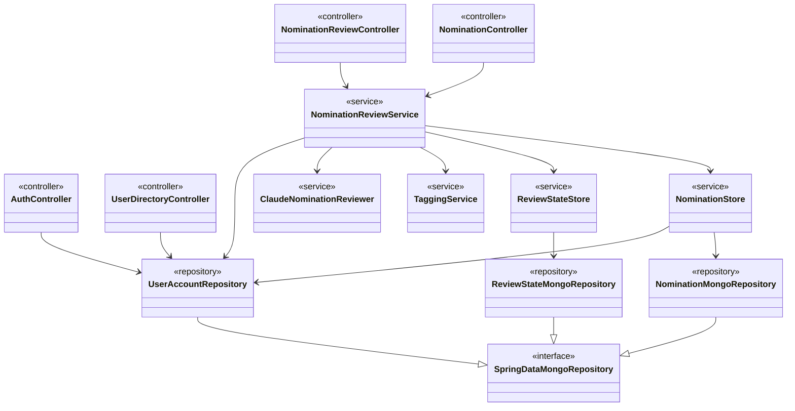

# Service, Controller & Repository Architecture

*Part of the [Star Awards class diagrams](README.md).*

The backend wiring: controllers receive HTTP requests, `NominationReviewService` orchestrates the work, and everything ultimately reads or writes through a Spring Data repository.

Supporting classes not shown for clarity: `NominationExcelLoader` (one-time spreadsheet seed), `UserAccountSeeder` (one-time demo accounts), `TaggingCliRunner` (a dev-only console tool), and the two `@Configuration` classes that provide the `AnthropicClient` and `PasswordEncoder` beans.
