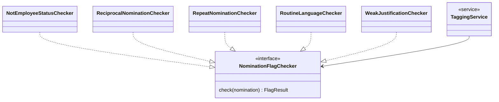

# Strategy Pattern — Nomination Flag Checkers

*Part of the [Star Awards class diagrams](README.md).*

Every rule-based tag is one implementation of `NominationFlagChecker`. `TaggingService` runs all of them against a nomination and collects whatever flags come back — adding a new tag means adding a new checker, never touching the service.

| Checker | What it flags |
| --- | --- |
| `NotEmployeeStatusChecker` | Placeholder — always passes until a real HR data source exists |
| `ReciprocalNominationChecker` | Nominee also nominated the nominator back |
| `RepeatNominationChecker` | Same nominee was also nominated last quarter |
| `RoutineLanguageChecker` | Justification uses generic, stock phrases |
| `WeakJustificationChecker` | Justification is short, vague, and cites no value or figure |
